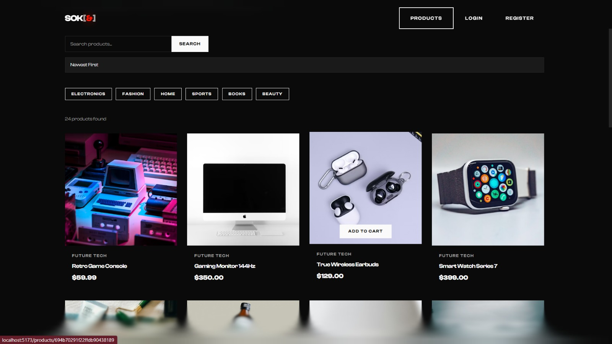

# 🛒 Sokoo - Multi-Vendor E-Commerce Platform

<div align="center">


**A full-stack MERN multi-vendor marketplace with smooth animations, vendor dashboards, and seamless shopping experience.**

[Features](#-features) • [Tech Stack](#-tech-stack) • [Installation](#-installation) • [Team](#-team) • [Contributing](#-contributing)

</div>

---

## 📸 Screenshots





---

## ✨ Features

### 🛍️ For Customers

- Browse products from multiple vendors
- Advanced product search and filtering
- Shopping cart with real-time updates
- Secure checkout process
- Order tracking and history
- User profile management

### 🏪 For Vendors

- Dedicated vendor dashboard
- Product management (CRUD operations)
- Order management and fulfillment
- Shop customization
- Sales analytics

### 🔐 Security & Performance

- JWT-based authentication
- Role-based access control (Admin, Vendor, User)
- Rate limiting & XSS protection
- MongoDB injection prevention
- Helmet security headers
- Smooth GSAP animations
- Lenis smooth scrolling

---

## 🛠️ Tech Stack

### Backend

| Technology            | Purpose             |
| --------------------- | ------------------- |
| **Node.js**           | Runtime environment |
| **Express.js**        | Web framework       |
| **MongoDB**           | Database            |
| **Mongoose**          | ODM                 |
| **JWT**               | Authentication      |
| **Multer**            | File uploads        |
| **Helmet**            | Security headers    |
| **Express Validator** | Input validation    |

### Frontend

| Technology          | Purpose          |
| ------------------- | ---------------- |
| **React 19**        | UI library       |
| **Vite**            | Build tool       |
| **React Router v7** | Routing          |
| **GSAP**            | Animations       |
| **Lenis**           | Smooth scrolling |
| **Axios**           | HTTP client      |
| **Lucide React**    | Icons            |

---

## 📁 Project Structure

```
sokoo/
├── 📂 client/                 # Frontend React app
│   ├── 📂 src/
│   │   ├── 📂 components/     # Reusable UI components
│   │   ├── 📂 context/        # React Context (Auth, Toast, Lenis)
│   │   ├── 📂 hooks/          # Custom hooks (GSAP, Scroll)
│   │   ├── 📂 pages/          # Page components
│   │   └── 📂 utils/          # API & animation utilities
│   └── 📄 package.json
│
├── 📂 config/                 # Database configuration
├── 📂 controllers/            # Route handlers
├── 📂 middleware/             # Custom middleware
├── 📂 models/                 # Mongoose schemas
├── 📂 routes/                 # API routes
├── 📂 uploads/                # Uploaded files
├── 📂 utils/                  # Helper utilities
├── 📄 server.js               # Entry point
└── 📄 package.json
```

---

## 🚀 Installation

### Prerequisites

- **Node.js** v18+
- **npm** or **yarn**
- **MongoDB** (local or Atlas)

### 1️⃣ Clone the repository

```bash
git clone https://github.com/nilanshukumarsingh/sokoo
cd sokoo
```

### 2️⃣ Backend Setup

```bash
# Install backend dependencies
npm install

# Create .env file
cp .env.example .env

# Add your environment variables
# MONGO_URI=your_mongodb_uri
# JWT_SECRET=your_jwt_secret
# NODE_ENV=development
# PORT=5000

# Start the server
npm run dev
```

### 3️⃣ Frontend Setup

```bash
# Navigate to client folder
cd client

# Install frontend dependencies
npm install

# Start development server
npm run dev
```

### 4️⃣ Access the Application

| Service     | URL                   |
| ----------- | --------------------- |
| Frontend    | http://localhost:5173 |
| Backend API | http://localhost:5000 |

---

## 🔑 Test Credentials

| Role         | Email               | Password      |
| ------------ | ------------------- | ------------- |
| **Admin**    | `user0@example.com` | `password123` |
| **Vendor**   | `user1@example.com` | `password123` |
| **Customer** | `user2@example.com` | `password123` |

> 💡 The backend auto-seeds demo data on startup for quick testing.

---

## 📡 API Endpoints

### Authentication

| Method | Endpoint             | Description       |
| ------ | -------------------- | ----------------- |
| POST   | `/api/auth/register` | Register new user |
| POST   | `/api/auth/login`    | Login user        |
| GET    | `/api/auth/me`       | Get current user  |

### Products

| Method | Endpoint            | Description             |
| ------ | ------------------- | ----------------------- |
| GET    | `/api/products`     | Get all products        |
| GET    | `/api/products/:id` | Get single product      |
| POST   | `/api/products`     | Create product (Vendor) |
| PUT    | `/api/products/:id` | Update product (Vendor) |
| DELETE | `/api/products/:id` | Delete product (Vendor) |

### Shops

| Method | Endpoint         | Description          |
| ------ | ---------------- | -------------------- |
| GET    | `/api/shops`     | Get all shops        |
| GET    | `/api/shops/:id` | Get single shop      |
| POST   | `/api/shops`     | Create shop (Vendor) |

### Orders

| Method | Endpoint          | Description       |
| ------ | ----------------- | ----------------- |
| GET    | `/api/orders`     | Get user orders   |
| POST   | `/api/orders`     | Create order      |
| GET    | `/api/orders/:id` | Get order details |

### Cart

| Method | Endpoint        | Description      |
| ------ | --------------- | ---------------- |
| GET    | `/api/cart`     | Get user cart    |
| POST   | `/api/cart`     | Add to cart      |
| DELETE | `/api/cart/:id` | Remove from cart |

---

## 👥 Team

<div align="center">

|                                           |
| :--------------------------------------------------------------------------------------------------------------------------: |
|                                                        **Anurag Jha**                                                        |
| [](https://github.com/jhaanurag) |
|                                                       _Lead Developer_                                                       |

</div>

### 🤝 Collaborators

We welcome contributions from the community! See our [Contributing Guide](#-contributing) below.

---

## 🤝 Contributing

We love contributions! Here's how you can help:

### Getting Started

1. **Fork the repository**

   ```bash
   # Click the 'Fork' button on GitHub
   ```

2. **Clone your fork**

   ```bash
   git clone https://github.com/YOUR_USERNAME/sokoo.git
   cd sokoo
   ```

3. **Add upstream remote**

   ```bash
   git remote add upstream https://github.com/nilanshukumarsingh/sokoo.git
   ```

4. **Create a feature branch**

   ```bash
   git checkout -b feature/amazing-feature
   ```

5. **Make your changes**

   - Write clean, documented code
   - Follow existing code style
   - Add tests if applicable

6. **Commit your changes**

   ```bash
   git add .
   git commit -m "feat: add amazing feature"
   ```

   > We follow [Conventional Commits](https://www.conventionalcommits.org/) specification

7. **Push to your fork**

   ```bash
   git push origin feature/amazing-feature
   ```

8. **Open a Pull Request**
   - Go to the original repository
   - Click "New Pull Request"
   - Select your branch and submit

### 📝 Commit Message Convention

| Type       | Description                     |
| ---------- | ------------------------------- |
| `feat`     | New feature                     |
| `fix`      | Bug fix                         |
| `docs`     | Documentation changes           |
| `style`    | Code style changes (formatting) |
| `refactor` | Code refactoring                |
| `test`     | Adding tests                    |
| `chore`    | Maintenance tasks               |

### 🐛 Reporting Issues

Found a bug? Please [open an issue](https://github.com/nilanshukumarsingh/sokoo/issues/new) with:

- Clear description
- Steps to reproduce
- Expected vs actual behavior
- Screenshots (if applicable)

---

## 📄 License

This project is licensed under the **ISC License** - see the [LICENSE](LICENSE) file for details.

---

## 🙏 Acknowledgments

- [React](https://react.dev/) - UI Library
- [GSAP](https://greensock.com/gsap/) - Animation Library
- [Lenis](https://github.com/studio-freight/lenis) - Smooth Scroll
- [Lucide](https://lucide.dev/) - Beautiful Icons
- [Express.js](https://expressjs.com/) - Backend Framework

---

<div align="center">

**⭐ Star this repo if you find it helpful!**

Made with ❤️ by [Nilanshu Kumar Singh](https://github.com/nilanshukumarsingh)

</div>
